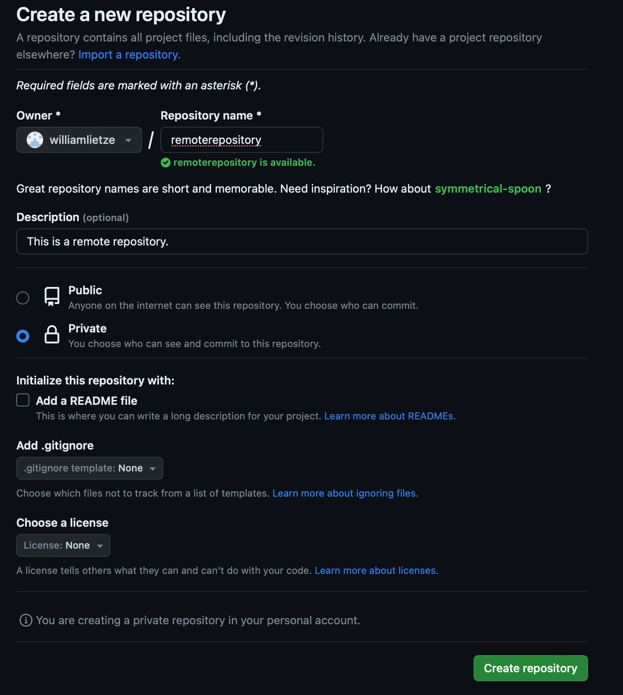

# Was ist Git?

Git ist ein verteiltes Versionskontrollsystem für Dateien. Es dient der Projektentwicklung auf Plattformen wie GitHub oder GitLab. Git eignet sich hervorragend für die Versionsverwaltung von Quellcode sowie für das Speichern flach strukturierter Datensätze.

## Erstellung eines Kontos

1. **Aufruf der offiziellen GitHub-Website**: Besuche die [GitHub-Website](https://github.com).

2. Konto erstellen über den Button "Sign up"

   

3. E-Mail-Adresse, Passwort und Benutzernamen festlegen

   

4. Den erstellten Account per E-Mail verifizieren

   

## Erstellung eines Repositories

1. Über das Hauptmenü zum eigenen Profil navigieren und "Your Repositories" auswählen

2. "New" auswählen

3. Name des Verzeichnisses und ggf. Beschreibung hinterlegen

4. Je nach Nutzung festlegen, ob das Repository öffentlich oder privat sein soll

5. Erstellen des Repositories

   
