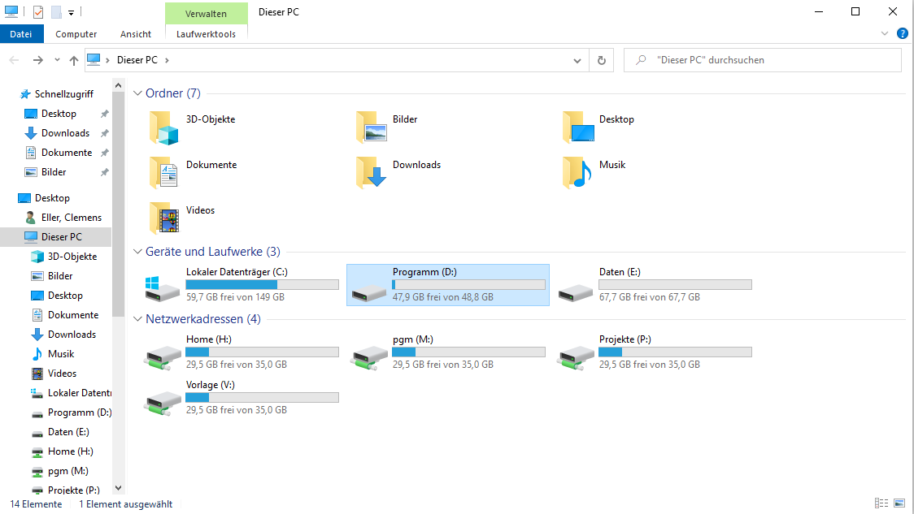
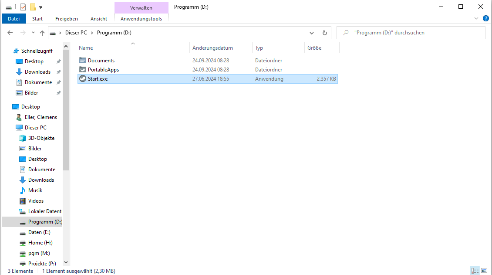
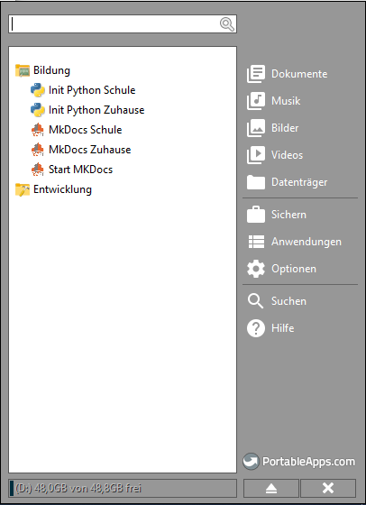

# MkDocs-Server Installationsanleitung

Diese Anleitung beschreibt die Schritte zur Installation und Konfiguration eines MkDocs-Servers.

## Installationsschritte

1. Öffnen Sie den Explorer und navigieren Sie zum Laufwerk D: (Programme)

   

2. Starten Sie die Datei `Start.exe`

   

3. Wählen Sie "MkDocs Schule" aus und warten Sie, bis der Vorgang abgeschlossen ist

   

4. Führen Sie "Start MkDocs Schule" aus und warten Sie, bis dieser Vorgang beendet ist

5. Der MkDocs-Server ist nun aufgesetzt und kann erreicht werden

6. Die Installation ist abgeschlossen

## Hinweise

- Stellen Sie sicher, dass Sie über die notwendigen Berechtigungen verfügen, um Programme auf Laufwerk D: zu installieren und auszuführen.
- Falls Probleme auftreten, überprüfen Sie, ob alle erforderlichen Abhängigkeiten installiert sind.
- Für weitere Informationen zur Nutzung von MkDocs, konsultieren Sie bitte die offizielle MkDocs-Dokumentation.

