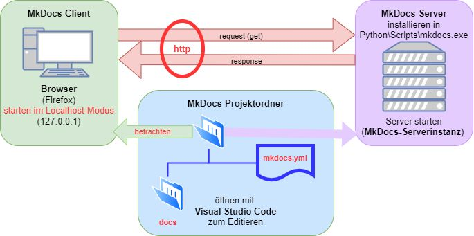

# Erklärung des MkDocs-Server-Prinzips

## Überblick
Das Bild zeigt das Prinzip des MkDocs-Servers, der für das Hosting und die Anzeige von Dokumentationsprojekten in einer webbasierten Umgebung genutzt wird. Nachfolgend wird der Prozess und die Interaktion der verschiedenen Komponenten erläutert.

---

## Komponenten

### 1. MkDocs-Client
- **Browser (z.B. Firefox)**: 
  - Der Benutzer startet den Browser im **Localhost-Modus** (127.0.0.1), um die Dokumentation zu betrachten.
  - Der Browser sendet **HTTP-Requests** (Anfragen) an den MkDocs-Server und empfängt **HTTP-Responses** (Antworten), um die Dokumentation anzuzeigen.
  - Localhost bedeutet, dass der Browser auf einen Webserver zugreift, der lokal auf dem Rechner läuft.

### 2. MkDocs-Server
- Der **MkDocs-Server** wird lokal auf dem Rechner installiert, typischerweise im Pfad Python\Scripts\mkdocs.exe.
- Der Server wird gestartet, wodurch eine **MkDocs-Serverinstanz** läuft. Diese Instanz nimmt HTTP-Anfragen vom Browser entgegen und liefert die entsprechende Dokumentation als Antwort zurück.
- MkDocs nutzt das **HTTP-Protokoll** (insbesondere GET-Requests), um die Dokumentation dynamisch an den Browser auszuliefern.

### 3. MkDocs-Projektordner
- Der Projektordner enthält die Dokumentationsdateien sowie die Konfigurationsdatei:
  - **docs-Ordner**: Dieser Ordner enthält die **Markdown-Dateien**, die die eigentliche Dokumentation bilden.
  - **mkdocs.yml**: Eine Konfigurationsdatei, die das **Layout**, das **Thema** und andere Einstellungen für die Dokumentation definiert.
- Zum Bearbeiten dieser Dateien wird üblicherweise ein Code-Editor wie **Visual Studio Code** verwendet.

---

## Workflow

1. Der Benutzer bearbeitet die **Dokumentationsdateien** und die **Konfigurationsdatei** (mkdocs.yml) in **Visual Studio Code**.
2. Die Änderungen können lokal über den **MkDocs-Server** betrachtet werden.
3. Der Benutzer öffnet den **Browser** und verbindet sich über localhost (127.0.0.1) mit dem MkDocs-Server.
4. Der Browser sendet eine **HTTP-Anfrage** an den Server, und dieser liefert die aktualisierte Dokumentation als **HTTP-Antwort** zurück.
5. Die Dokumentation wird dynamisch im Browser angezeigt.

---

## Zusammenfassung
Der **MkDocs-Client** (Browser) sendet HTTP-Anfragen an den **MkDocs-Server**, welcher die Inhalte aus dem **MkDocs-Projektordner** bereitstellt. Der Benutzer kann die Dokumentation durch Bearbeitung der **Markdown-Dateien** und der **mkdocs.yml**-Konfigurationsdatei in **Visual Studio Code** anpassen, während der Server diese Änderungen im Browser anzeigt.
