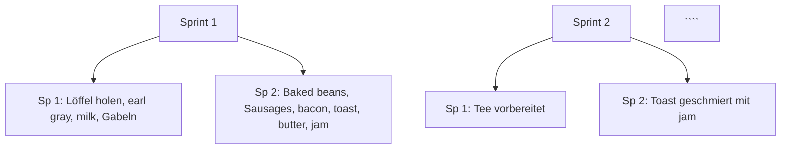

# Lösungen
## 1. Startseite mit Titel und Autoren
```	
# English Breakfast Project

## Autoren
- **Kunde:** Tillmann, Raphi
- **Product Owner:** Tim Haake
- **Sprint Team 1:** Falco, Benny, Marcel, Florian, Leon, Eric
- **Sprint Team 2:** Anna, Jule, Heiko, Josef, Klemens, Timo, Clemens, Luca


## Kundenanforderungen
Der Kunde wünscht sich ein traditionelles **English Breakfast**, das folgende Bestandteile umfasst:
```
## 2. Gliederungen

```
# Gliederung - English Breakfast Projekt

## 1. Kunden und Teamaufstellung
### 1.1. Kunde
- Tillmann, Raphi  

### 1.2. Product Owner
- Tim Haake  

### 1.3. Sprint Team 1
- Falco  
- Benny  
- Marcel  
- Florian  
- Leon  
- Eric  

### 1.4. Sprint Team 2
- Anna  
- Jule  
- Heiko  
- Josef  
- Klemens  
- Timo  
- Clemens  
- Luca  

---

## 2. Kundenanforderungen

### 2.1. English Breakfast Bestandteile

### 2.2. Utensilien
- Teller  
- Messer  
- Gabel  
- Löffel  

### 2.3. Essen
- Baked Beans (Heinz)  
- Sausages  
- Bacon  
- Toast + Butter  
- Jam  

### 2.4. Getränke
- Earl Grey Tea  
- Milch  
- Zucker  

---

## 3. Sprints

### 3.1. Budget
- Sprint Team 1: 5 Euro  
- Sprint Team 2: 15 Euro  

### 3.2. Sprint 1 (15 Minuten)

#### Aufgaben Sprint Team 1
- Löffel holen  
- Earl Grey Tea besorgen  
- Milch holen  
- Gabeln organisieren  

#### Aufgaben Sprint Team 2
- Baked Beans vorbereiten  
- Sausages braten  
- Bacon braten  
- Toast vorbereiten  
- Butter und Jam bereitstellen  

### 3.3. Sprint 2 (30 Minuten)

#### Aufgaben Sprint Team 1
- Tee vorbereiten  

#### Aufgaben Sprint Team 2
- Toast mit Jam bestreichen  

---

## 4. Ressourcen
- Teller  
- Messer  
- Kekse  
- 20 Euro  
- Tassen  
- Wasserkocher  

```

## 3. Unterseiten

```
# Startseite - English Breakfast Projekt

## 1. Kunden und Teamaufstellung
   - [1.1. Kunde und Product Owner](kunden-und-product-owner.md)
   - [1.2. Sprint Team 1](sprint-team-1.md)
   - [1.3. Sprint Team 2](sprint-team-2.md)

```

## 4. Aufzählungen

```
# Gliederung - English Breakfast Projekt

## 1. Kunden und Teamaufstellung
1.1. Kunde:  
   1. Tillmann, Raphi  

1.2. Product Owner:  
   1. Tim Haake  

1.3. Sprint Team 1:  
   1. Falco  
   2. Benny  
   3. Marcel  
   4. Florian  
   5. Leon  
   6. Eric  

1.4. Sprint Team 2:  
   1. Anna  
   2. Jule  
   3. Heiko  
   4. Josef  
   5. Klemens  
   6. Timo  
   7. Clemens  
   8. Luca  

---

## 2. Kundenanforderungen

2.1. English Breakfast Bestandteile

2.2. Utensilien:  
   1. Teller  
   2. Messer  
   3. Gabel  
   4. Löffel  

---

## 3. Sprints

3.1. Budget:  
   1. Sprint Team 1: 5 Euro  
   2. Sprint Team 2: 15 Euro  

3.2. Sprint 1 (15 Minuten)

   3.2. Aufgaben Sprint Team 1:  
      1. Löffel holen  
      2. Earl Grey Tea besorgen  
      3. Milch holen  
      4. Gabeln organisieren  

3.3. Sprint 2 (30 Minuten)

   3.3.1. Aufgaben Sprint Team 1:  
      1. Tee vorbereiten  

   3.3.2. Aufgaben Sprint Team 2:  
      1. Toast mit Jam bestreichen  

---

## 4. Ressourcen
   1. Teller  
   2. Messer  
   3. Kekse  
   4. 20 Euro  
   5. Tassen  
   6. Wasserkocher  

```

## 5. Hinweisboxen

```
# Hinweisboxen

Hinweise werden wie folgt geschrieben:  > **Hinweis:** 

## 1. Kunden und Teamaufstellung

> **Hinweis:** Die Kunden und das Team sind wie folgt aufgeteilt:


## 2. Kundenanforderungen

> **Hinweis:** Diese Anforderungen wurden vom Kunden spezifiziert und müssen erfüllt werden.


## 3. Sprints

> **Hinweis:** Es gibt zwei Sprints, die in verschiedenen Teams mit unterschiedlichen Aufgaben aufgeteilt sind.


## 4. Ressourcen

> **Hinweis:** Diese Ressourcen stehen den Teams zur Verfügung.

```

## 6. Tabellen

```
# Gliederung - English Breakfast Projekt

## 1. Kunden und Teamaufstellung

| Kunde           | Product Owner  |
|-----------------|----------------|
| Tillmann, Raphi | Tim Haake       |

| Sprint Team 1   | Sprint Team 2   |
|----------------|-----------------|
| Falco           | Anna            |
| Benny           | Jule            |
| Marcel          | Heiko           |
| Florian         | Josef           |
| Leon            | Klemens         |
| Eric            | Timo            |
|                 | Clemens         |
|                 | Luca            |

---

## 2. Kundenanforderungen

### 2.1. English Breakfast Bestandteile

| Kategorie  | Items                                  |
|------------|----------------------------------------|
| Utensilien | Teller, Messer, Gabel, Löffel          |
| Essen      | Baked Beans (Heinz), Sausages, Bacon, Toast + Butter, Jam |
| Getränke   | Earl Grey Tea, Milch, Zucker           |

---

## 3. Sprints

### 3.1. Budget

| Sprint Team 1 | Sprint Team 2 |
|---------------|---------------|
| 5 Euro        | 15 Euro       |

### 3.2. Sprint 1 (15 Minuten)

| Team          | Aufgaben                                               |
|---------------|--------------------------------------------------------|
| Sprint Team 1 | Löffel holen, Earl Grey Tea besorgen, Milch holen, Gabeln organisieren |
| Sprint Team 2 | Baked Beans vorbereiten, Sausages braten, Bacon braten, Toast vorbereiten, Butter und Jam bereitstellen |

### 3.3. Sprint 2 (30 Minuten)

| Team          | Aufgaben                            |
|---------------|-------------------------------------|
| Sprint Team 1 | Tee vorbereiten                     |
| Sprint Team 2 | Toast mit Jam bestreichen           |

---

## 4. Ressourcen

| Ressourcen    | Verfügbar              |
|---------------|------------------------|
| Teller        | Ja                     |
| Messer        | Ja                     |
| Kekse         | Ja                     |
| Budget        | 20 Euro                |
| Tassen        | Ja                     |
| Wasserkocher  | Ja                     |

```

## 7. Verzeichnisse

```
# Inhaltsverzeichnis
1. [Beteiligte](#beteiligte)
2. [Kundenanforderungen](#kundenanforderungen)
    - [Utensilien](#utensilien)
3. [Sprint Planung](#sprint-planung)
    - [Sprint 1](#sprint-1)
    - [Sprint 2](#sprint-2)
4. [Verfügbare Ressourcen](#verfügbare-ressourcen)

---

# English Breakfast - Projektaufteilung

## Beteiligte
...

## Kundenanforderungen
...

## Sprint Planung
...

## Verfügbare Ressourcen
...

```

## 8. Bilder 

Ein Bild lässt sich wie folgt in ein Markdown Dokument einfügen: ``` { width=50% } ```

## 9. Flussgraphen

Ein Flussgraph hat die Bedingung, dass mermaid vorhanden ist. Ist es vorhanden kann ein Flussgraph so aussehen: 
```

## 10. ein Impressum in der Mkdocs-Dokumentation erstellen

ein Impressum kann in einer extra angelegten markdown Datei wie folgt aussehen:
```
# Impressum

Verantwortlich für den Inhalt:

**Firma:**  
Frühstücks AG  
**Adresse:**  
Frühstücksstraße 1, 12345 Frühstückshausen  
**Kontakt:**  
E-Mail: info@fruehstuecksag.de  
Telefon: +49 123 456789
```
## 11. LaTeX Formeln

Die benötigte LaTeX Formel sieht so aus: 

```
Die benötigte Anzahl an Utensilien pro Person für das English Breakfast kann berechnet werden als:

$$

U = G + T + L

$$

wobei:

- \( U \) = Gesamtanzahl der Utensilien pro Person

- \( G \) = Anzahl der Gabeln pro Person (1)

- \( T \) = Anzahl der Teller pro Person (1)

- \( L \) = Anzahl der Löffel pro Person (1)

```

## 12. Fußnoten und Verweise

Der Code für die Fußnoten und Verweise ist:
```
Der Kunde wünscht ein traditionelles englisches Frühstück[^1].

[^1]: Ein klassisches englisches Frühstück besteht typischerweise aus Baked Beans, Sausages, Bacon und Toast.

Mehr Informationen zu [English Breakfast](https://de.wikipedia.org/wiki/English_Breakfast).
```

## 13. das Farblayout der Seite ändern

Das Farblayout kann wir folgt geändert werden: 
``` 
theme:
  name: 'material'
  palette:
    primary: 'deep orange'
    accent: 'blue'
```

## 14. das Logo der Seite ändern

Das Logo kann in der Yaml Datei verändert werden:
```
theme:
logo: 'images/logo.png'
```

## 15. automatisch nummerierte Abbildungsnummern in Mkdocs-Dokumentation erzeugen

```
{#fig:1}

Abbildung 1 zeigt ein klassisches English Breakfast.

#zweiter Teil
Wie in [Abbildung 1](#fig:1) gezeigt,... 
```