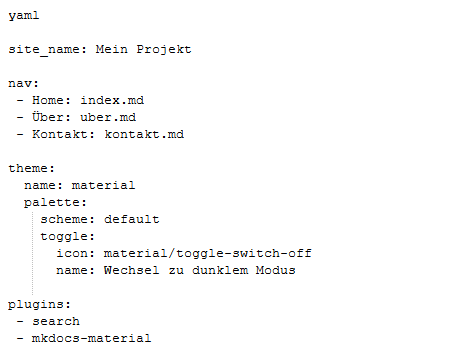

# YAML

## YAML-Datei Beschreibung

YAML (YAML Ain't Markup Language) wird häufig in der Softwareentwicklung für Konfigurationsdateien verwendet. Hier sind einige wichtige Punkte:

- Sie werden oft für Konfigurationsdateien genutzt.
- Die Dateiendung ist üblicherweise ".yml" oder ".yaml".
- YAML ist ein Superset von JSON, d.h. jede gültige JSON-Datei ist auch eine gültige YAML-Datei.
- YAML steuert das Verhalten von MkDocs.
- Es definiert die Projektstruktur, das Theme und die Plugins.

## Beispiel einer YAML-Datei

Hier ist ein einfaches Beispiel für eine YAML-Datei, die die Konfiguration eines MkDocs-Projekts beschreibt:

